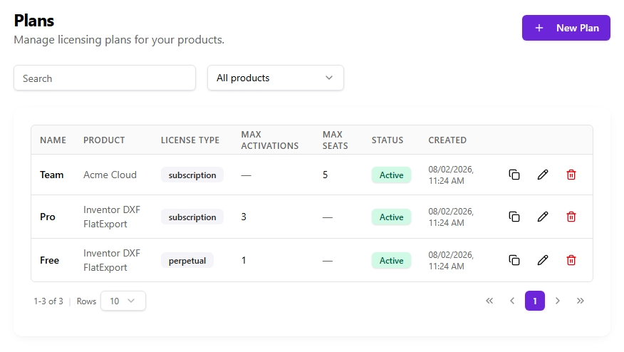
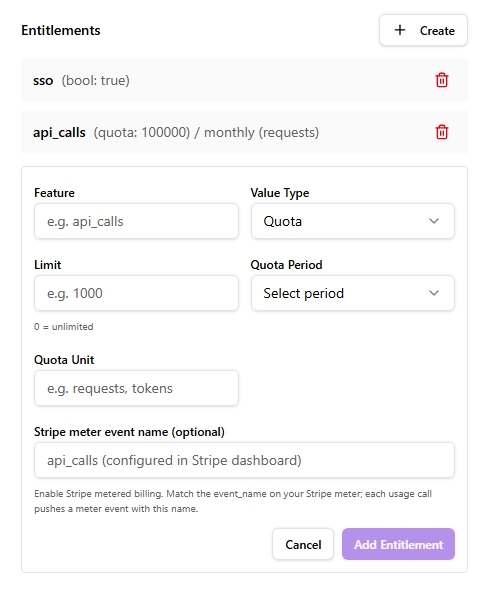

# Products & Plans

Keygate's data model is three layers: a **product** is the software you sell, a **plan** is a tier of that product, and a **license** is one customer's entitlement to a plan.

```text
Product  (Inventor DXF Export, type: desktop)
  └── Plan  (Pro, subscription, max_activations: 3)
        ├── Entitlement  (dxf_export, quota, 20/day)
        └── License  (KG-XXXX-…, customer@example.com, status: active)
```

## Products

A product represents one piece of software. Its **type** gates which capabilities its plans can use:

| Type | Activations (per-device) | Seats (per-user) | Release feeds |
|------|:---:|:---:|:---:|
| `desktop` | ✅ | — | ✅ |
| `saas` | — | ✅ | — |
| `hybrid` | ✅ | ✅ | ✅ |

The product type decides *what capabilities exist*; it's independent of the commercial model (a `desktop` product can still be sold as a subscription). Configuring a capability a product doesn't support (e.g. `max_seats` on a `desktop` plan) is rejected.

Other product fields:

- **`minimum_supported_version`** — a semver floor embedded in update feeds so old clients can force-upgrade.
- **`require_signing`** — when true (the default), publishing a release fails unless an active signing key exists. Flip off only for intentionally unsigned builds (CI test artifacts).

## Plans

<!-- Placeholder — replace docs/assets/plans-list.png with a real screenshot of the admin Plans list. -->
<figure class="screenshot" markdown="span">

</figure>

A plan is a purchasable tier. Its key fields:

| Field | Meaning |
|-------|---------|
| `license_type` | `subscription`, `perpetual`, or `trial` — see [Licensing Models](licensing-models.md). |
| `license_model` | `standard` or `floating` (concurrent seat checkout). |
| `max_activations` | Devices a license may activate on. `0` = unlimited (where the product supports activations). |
| `max_seats` | Team members a license may invite (saas/hybrid). |
| `trial_days` | For `trial` plans, the trial length. New licenses get `valid_until = now + trial_days`. |
| `grace_days` | Days a license stays usable past `valid_until` before it's expired. Default 7. |
| `support_days` | Default paid-support window for new licenses. `0` = unlimited support. See [The Support Window](support-window.md). |
| `stripe_price_id` | Stripe Price for buying this plan. |
| `support_renewal_price_id` | Stripe Price for a one-time support renewal. Empty = renewal not offered. |
| `checkout_id` | Short id used in the public checkout URL `/pay/{checkout_id}`. |

## Entitlements

Entitlements attach capabilities to a plan. Each has a `feature` name and a `value_type`:

| `value_type` | Meaning | `value` holds |
|--------------|---------|---------------|
| `bool` | A feature flag (on/off) | `true` / `false` |
| `int` | A numeric limit | the number |
| `string` | A configuration value | the string |
| `quota` | A metered usage cap | **the numeric limit** (e.g. `20`) |

For a **quota** entitlement, additional fields apply:

- **`quota_period`** — `hourly`, `daily`, `monthly`, or `yearly`. Counters reset automatically at the period boundary (UTC-based).
- **`quota_unit`** — a display label only (e.g. `exports`). **Not** the limit.

In the **admin dashboard** the *Value* field adapts to the chosen type — an Enabled/Disabled toggle for `bool`, a number field for `int`, and a numeric **Limit** field (with a *0 = unlimited* hint) for `quota` — so the value is entered correctly without guesswork.

<!-- Placeholder — replace docs/assets/entitlement-editor.png with a real screenshot of the entitlement editor dialog (quota selected). -->
<figure class="screenshot" markdown="span">

</figure>

!!! warning "Quota limit goes in `value`, not `quota_unit` (API)"
    When creating entitlements directly via the **admin API**, put the numeric limit in `value` — not in `quota_unit`, and never leave it as `true`. Keygate parses the limit from `value`; a non-numeric `value` parses to `0`, and a `0` limit is treated as **unlimited**, so the cap silently never fires. For a 20/day cap: `value_type: quota`, `value: 20`, `quota_period: daily`. (The dashboard's typed Value field prevents this — the warning applies to raw API use.)

Entitlements are returned to clients in the verify/activate response (`features` map) and embedded in the [offline token](../integration/offline-tokens.md). Quota entitlements are enforced by the [usage metering](../integration/sdk.md#usage-metering) endpoints.

## Licenses

A license is created when a customer buys (via Stripe) or when you issue one through the admin API. Key fields beyond the plan link:

- **`status`** — `active`, `trialing`, `past_due`, `canceled`, `expired`, `suspended`, `revoked`.
- **`valid_from` / `valid_until`** — the license's validity window. `valid_until` empty = never expires (perpetual).
- **`support_until`** — the paid-support/updates window, independent of `valid_until`. See [The Support Window](support-window.md).
- **`external_customer_id` / `external_workspace_id`** — opaque strings you own, for mapping Keygate licenses to your own user/tenant model.

The license lifecycle (expiry, grace, dunning) is driven by an hourly background checker; you can trigger it on demand with `POST /admin/system/run-expiry-checks`.
