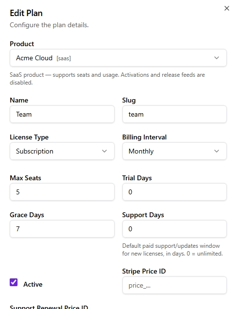

# The Support Window

The **support window** lets you sell a perpetual license (never expires) while charging separately for updates and support — the JetBrains model. This page covers the concept, enforcement, notifications, and renewal.

## The idea

Two independent dates live on a license:

- **`valid_until`** — when the *license itself* stops working. For perpetual licenses this is empty (never).
- **`support_until`** — when the *paid support/updates window* ends. Independent of `valid_until`.

The license keeps verifying and running past `support_until`. What lapses is access to **new releases** — a customer keeps every version published while their support was active (perpetual fallback), and renews to get newer ones.

## Setting the window

| Where | How |
|-------|-----|
| Per-plan default | `support_days` on the plan. New licenses get `support_until = now + support_days`. `0` = unlimited support. |
| At issuance | Pass `support_until` (RFC 3339) when creating a license, overriding the plan default. |
| Per-license, later | `POST /admin/licenses/{id}/support-until` with `{ "support_until": "2027-01-01T00:00:00Z" }`. An empty value clears it (unlimited). |

<!-- Placeholder — replace docs/assets/support-window.png with a real screenshot of the license detail showing the support window / "Perpetual" fields. -->
<figure class="screenshot" markdown="span">

</figure>

Setting `support_until` never changes the license `status` — support lapse is deliberately **not** a lifecycle event. Reinstating an expired license stays a separate, explicit action.

## Enforcement: perpetual fallback on downloads

The support window is enforced at **download time** ([license-gated downloads](../integration/updates.md)), not at verify time:

- A customer can always re-download any release **published before** their `support_until` — forever.
- Requesting the *latest* release resolves to the newest version their support window covers.
- Pinning a version newer than the window returns **`403 SUPPORT_EXPIRED`**.
- A license with no `support_until` (nil) has unlimited support.

`verify` keeps succeeding regardless, so the installed app never stops working — only its updater is gated.

## What clients see

`support_until` is surfaced so your client can show renewal UX:

- In the **verify/activate response** as `support_until`.
- In the **signed offline token** as `sup` (unix seconds; `0`/absent = unlimited). Your app can read it offline and show "support expires in N days."

## Notifications

The hourly lifecycle checker sends support-window emails, deduped per `support_until` epoch (so a renewal re-arms a fresh reminder cycle):

- **30 days and 7 days before** `support_until` — a "support ending soon" reminder.
- **After lapse** (scanned up to 7 days back so an outage can't swallow it) — a "support has ended" notice, plus a `license.support_ended` webhook.

The wording is deliberately soft — the software keeps working; only updates stop — because this is renewal-sales mail, not an outage warning. All templates are customizable in the dashboard's email editor.

## Renewal (self-serve, via Stripe)

Customers renew their own support window through Stripe:

1. Set a **one-time** Stripe Price on the plan's `support_renewal_price_id`.
2. The client calls `POST /license/support/checkout` with `{ license_key }` and receives a `{ checkout_url }`.
3. On payment, the Stripe webhook extends `support_until` — anchored at `max(now, current support_until)` so early renewers stack their remaining time, by the plan's `support_days` (default 365).
4. A `license.support_renewed` webhook fires and a confirmation email is sent.

See [Stripe Integration → Support renewal](../billing/stripe.md#support-window-renewal) for the full setup.

## Summary

| | Perpetual | Perpetual + paid support |
|---|:---:|:---:|
| License expires | Never | Never |
| Gets all future updates | ✅ forever | ✅ while support active |
| Recurring revenue | ❌ | ✅ (support renewals) |
| Enforcement point | — | Download / update feed |
